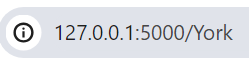

# departureDashboard 
Web app that queries the national rail enquiries API to display departures from the Users' chosen station.
The user can either input station code or name as the backend converts the users' input to the code in order to query the API.

Index displays a form in the style of a departure board and displays departures from a random uk station.
Once they have entered the station they want and pressed the search button this what they then see:

Again the options menu is in the style of a departure board, the user can either refresh the page or return to the home page.
CallingAt section scrolls like real a real life departure board if the text is over a certain length

The user can also load whatever station they want from the url with the name or code for a station.
Do plan to host this on a cloud service very soon.